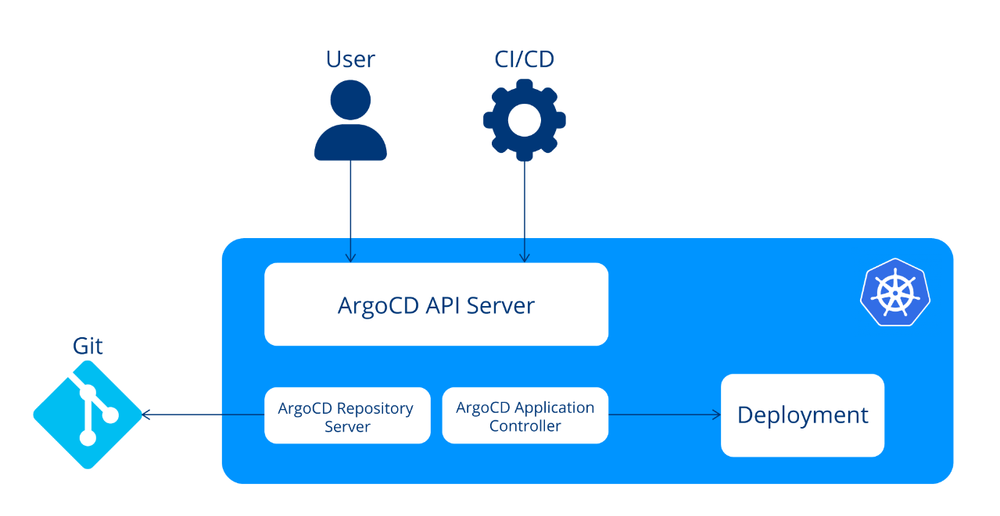
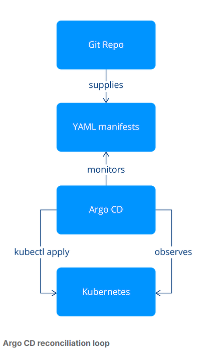

# Chapter Overview and Objectives
In this chapter, we explore the detailed aspects of Argo CD, a pivotal tool within the Argo suite, designed specifically for Continuous Delivery (CD) and GitOps practices. Through thematic discussions and hands-on labs, we aim to equip you with a comprehensive understanding of Argo CD's architecture, installation, configuration, security considerations, and its extensibility.

By the end of this chapter, you should be able to:

Explain how Argo CD leverages the GitOps principles.
Describe the core components of Argo CD, their roles and tasks.
Install and configure Argo CD on a Kubernetes cluster.
Deploy and update applications using Argo CD.

## What is Argo CD?
Argo CD is a declarative, GitOps continuous delivery tool for Kubernetes. Compared to the standard Kubernetes workflow, Argo CD introduces a number of enhancements.

## Key Advancements

### GitOps
With Argo CD, the desired state of your application is described in a Git repository. This means that all changes to your application are version controlled and can be easily tracked. This is a significant improvement over the standard Kubernetes workflow, where changes are made directly on the cluster and can be difficult to track.

### Continuous Delivery
Argo CD continuously monitors your Git repository and automatically deploys any changes to your Kubernetes cluster. This eliminates the need to manually run kubectl apply whenever you want to deploy changes, making the deployment process more efficient and less error-prone.

### Rollbacks
If something goes wrong with a deployment, Argo CD allows you to easily roll back to a previous version of your application. This is much more difficult with the standard Kubernetes workflow, where you would need to manually revert your changes and reapply them to the cluster.

### Multi-environment management
Argo CD makes it easy to manage multiple environments (like Dev, Staging, Production) from a single Git repository. This is a significant improvement over the standard Kubernetes workflow, where managing multiple environments can be complex and error-prone.

### UI and API
Argo CD provides a user-friendly UI and a powerful API, making it easier to manage and monitor your applications. This is a significant improvement over the standard Kubernetes workflow, which relies heavily on command-line tools.

## Vocabulary
In the world of Argo CD, understanding the specific vocabulary is crucial for effectively managing and deploying applications within Kubernetes environments. These terms form the core language used to describe various aspects and operations within Argo CD, a declarative, GitOps continuous delivery tool for Kubernetes. By familiarizing yourself with this vocabulary, you gain the ability to precisely communicate and execute tasks related to application deployment and management. This knowledge not only streamlines your workflow but also enhances collaboration with team members, as you all share a common understanding of these key concepts.

Each term encapsulates a distinct aspect of the Argo CD ecosystem. From defining the structure and sources of your applications to understanding their operational states and health, this vocabulary covers the breadth of the deployment process. Knowing the difference between 'Target state' and 'Live state', for instance, is essential for maintaining the integrity and desired functionality of your applications. Similarly, grasping the nuances of various statuses and actions like 'Sync status' and 'Refresh' enables you to effectively monitor, troubleshoot, and update your Kubernetes resources. In essence, these terms are the building blocks for mastering Argo CD and ensuring a smooth, efficient deployment pipeline in Kubernetes.

## Main Concepts

### Configuration
- Application: A collection of Kubernetes resources defined by manifests, specified in Argo CD as Custom Resource Definitions (CRDs).
- Application source type: The tool utilized for building applications, such as Helm or Kustomize.

### States
- Target state: The desired state of an application, represented in a Git repository, serving as the source of truth.
- Live state: The current state of the application, indicating the deployed Kubernetes resources.

### Statuses
- Sync status: The status indicating whether the live state aligns with the target state. Essentially, it confirms if the application deployed in Kubernetes matches the desired states outlined in the Git repository.
- Sync operation status: The status during the sync phase, specifying whether it has failed or succeeded.
- Health status: The well-being of the application, assessing its running condition and ability to handle requests.

### Actions
- Refresh: The act of comparing the latest code in Git with the live state to identify any differences.
- Sync: The process of transitioning an application to the target state by applying changes in the Kubernetes cluster.

## Controllers
To get started, we will take a look at Argo CDs core components and how they work with each other.

Argo CD employs Kubernetes controllers for its core functions. A Kubernetes controller, including those in Argo CD, monitors the cluster's state and ensures it aligns with the desired state by initiating or requesting changes when necessary. This is achieved by observing Kubernetes resource objects, each specifying the intended state through a spec field.

## API Server
The API server in Argo CD serves as a communication hub, allowing different systems like the Web UI, CLI, Argo Events, and CI/CD tools to interact with it. Think of it as a central control tower for managing applications. Its main job is to keep track of the applications, providing status updates so you know what's happening with them. When it's time to make changes or updates, the API server triggers the necessary operations on these applications.

Beyond that, the API server wears multiple hats. It takes care of handling Git repositories and Kubernetes clusters, ensuring a smooth connection between your code and your infrastructure. Security-wise, it's the gatekeeper, handling authentication and Single Sign-On (SSO) support. Additionally, the API server enforces Role-Based Access Control (RBAC) policies, making sure that the right people have the right level of access to keep everything secure and organized. In essence, it's the behind-the-scenes maestro making sure everything in your Argo CD setup plays in harmony. The following actions encapsulate its specific roles in managing applications and facilitating communication:

Manages applications and provides status updates
Triggers operations on applications when needed
Handles Git repositories for version control
Manages connections with Kubernetes clusters
Takes care of authentication and support Single Sign-On (SSO)
Enforces Role-Based Access Control (RBAC) policies
Serves as a central hub for communication with Web UI, CLI, Argo Events, and CI/CD systems

## Repository Server
Connected to the API Server is the Argo CD Repository Server, which is responsible for retrieving the desired state of applications from Git repositories and packaging it into a format that can be understood by Kubernetes. This server communicates with your Git repositories and fetches the necessary information. It maintains a local cache of the Git repositories holding the application manifests.

Other services of Argo request Kubernetes manifests using the following arguments:

Repository URL
Git revision
Application path
Templating relevant information such as parameters or Helm's values.yaml

## Application Controller
The Argo CD Application Controller is another crucial component. It continuously compares the desired application state (as defined in your Git repositories) with the live state in your Kubernetes cluster. If it detects any discrepancies, it will take corrective action to ensure that the live state matches the desired state.



## How Does the Argo CD Reconciliation Loop Work?
Argo CD's reconciliation process involves aligning the intended configuration specified in a Git repository with the current state in the Kubernetes cluster. This continuous loop, known as the reconciling loop, is illustrated in the following figure.



When utilizing Helm, Argo CD monitors the Git repository, employs Helm to generate Kubernetes manifest YAML through template execution, and compares it with the cluster's desired state, known as sync status. If disparities are identified, Argo CD utilizes kubectl apply to implement the changes and update the Kubernetes desired state. It's noteworthy that Argo CD, in this process, opts for kubectl apply over helm install to support various templating tools while maintaining its role as a GitOps declarative tool without being tied to a specific templating tool.

The Argo CD reconciliation loop embodies the principles of GitOps by maintaining a Git repository as the single source of truth for infrastructure definitions. This process aligns with the GitOps principles of having a declarative desired state, which is versioned and immutable, and is automatically pulled by software agents. The agents continuously observe the actual system state and attempt to reconcile it with the desired state, mirroring the continuous reconciliation principle of GitOps. Thus, the Argo CD reconciliation loop is a practical implementation of GitOps principles.

## Synchronization Principles
The sync phase is a very important operation and its behavior can be customized by using resource hooks and sync waves. In this section, we explore both ways of customization and learn how to use them.

## Customization Solutions

### Resource hooks
A sync, as described in the "Vocabulary" section, is the transition of an application into the target state. There are five possible definitions of when a resource hook can be run:

- PreSync, execute before the Sync phase (e.g., create a backup before syncing)
- Sync, execute after all PreSync hooks completed successfully and do actions during application of the manifests (e.g., for more complex rollout strategies like blue-green or canary instead of Kubernetes rolling update)
- PostSync, execute after all successful Sync hooks and application, and all resources are in Healthy state (e.g., run additional health checks after deployment or run integration checks)
- Skip, indicates Argo CD to skip the application of the manifest
- SyncFail, executes when Sync fails (e.g., clean up operations)

To keep things simple, resource hooks use the Kubernetes kind Job and are identified by an annotation. Using the annotation Argo CD identifies Jobs and when they should be executed.

The following is an example for a database schema migration resource hook:

```yaml
apiVersion: batch/v1
kind: Job
metadata:
  generateName: schema-migrate-
  annotations:
    argocd.argoproj.io/hook: PreSync
```

More information regarding resource hooks can be found in the official Argo CD documentation.

### Sync waves
Essentially sync waves are a convenient way to split and order to-be-synced manifests. Waves can range from negative to positive values. If not defined, the default value is wave zero. Using sync waves is achieved in the same way as resource hooks; by using annotations.

```yaml
metadata:
  annotations:
    argocd.argoproj.io/sync-wave: "5"
```

Both approaches can be utilized simultaneously. The sync operation in Argo CD initiates with the ordering of resources based on the following criteria:

- Resource hook phase annotation
- Sync wave annotation
- Kubernetes kind (for example, namespaces are prioritized, followed by other Kubernetes resources and then custom resources)
- Name

Afterwards the next wave number to be applied is identified. This number is always the lowest among any out-of-sync or unhealthy resources. Argo CD then applies this wave.

This process is repeated until all phases and waves are in sync and healthy.

However, if an application has unhealthy resources in the initial wave, it may prevent the application from ever reaching a healthy state.

For safety reasons, Argo CD adds a 2-second delay between each sync wave. This can be customized using the ARGOCD_SYNC_WAVE_DELAY environment variable.

## Simplifying Application Management
Argo CD simplifies the management of your applications in Kubernetes environments by utilizing Custom Resource Definitions (CRDs).

## Key Elements

### Application
Argo CD introduces the Application CRD, serving as a representation of the application instance you intend to deploy in your Kubernetes cluster. Think of it as the blueprint for your application within the specified environment. Example:

```yaml
apiVersion: argoproj.io/v1alpha1
kind: Application
metadata:
  name: guestbook
  namespace: argocd
spec:
  project: default
  source:
    repoURL: 'htt‌ps://github.com/argoproj/argocd-example-apps.git'
    targetRevision: HEAD
    path: guestbook
destination:
  server: 'htt‌ps://kubernetes.default.svc'
  namespace: guestbook
```

### AppProject
For efficient organization, Argo CD provides the AppProject CRD. This allows you to group related applications. An example use case involves segregating applications from utility services, enhancing the clarity of your project structure. Example:

```yaml
apiVersion: argoproj.io/v1alpha1
kind: AppProject
metadata:
  name: production
  namespace: argocd
spec:
  description: Production applications
  sourceRepos:
    - '*'
  destinations:
    - namespace: production
      server: 'htt‌ps://kubernetes.default.svc'
  clusterResourceWhitelist:
    - group: '*'
      kind: '*'
```

### Repository credentials
In real-world scenarios, accessing private repositories is common. Argo CD facilitates this by using Kubernetes Secrets and ConfigMaps. To grant Argo CD access, create the necessary Secret Kubernetes resources with a specific label: rgocd.argoproj.io/secret-type: repository. Example:

```yaml
apiVersion: v1
kind: Secret
metadata:
  name: private-repo-creds
  namespace: argocd
  labels:
    argocd.argoproj.io/secret-type: repository
stringData:
  url: 'htt‌ps://github.com/private/repo.git'
  username: <username>
  password: <password>
```

### Cluster credentials
In cases where Argo CD manages multiple Kubernetes clusters, additional access may be required. For this purpose, Argo CD utilizes a distinct Secret type with the label: argocd.argoproj.io/secret-type: cluster. This ensures secure access to external clusters not initially included in Argo CD's managed environments. Example:

```yaml
apiVersion: v1
kind: Secret
metadata:
  name: external-cluster-creds
  labels:
    argocd.argoproj.io/secret-type: cluster
type: Opaque
stringData:
  name: external-cluster
  server: 'ht‌tps://external-cluster-api.com'
  config: |
    {
      "bearerToken": "<token>",
      "tlsClientConfig": {
         "insecure": false,
         "caData": "<certificate encoded in base64>"
      }
    }
```

By understanding and utilizing these fundamental Argo CD objects, you can effectively streamline the deployment and management of your applications across diverse Kubernetes environments.

## Plugins
Argo CD's strength lies in its extensibility through plugins, allowing users to tailor the tool to their specific needs. In this section, we will explore the concept of Argo CD plugins, understand how to configure them using ConfigMaps, and witness the Notifications plugin in action. Additionally, we'll highlight a few other notable plugins to showcase the versatility of Argo CD extensions.

## Understanding Plugins in Argo CD
Argo CD plugins extend the core functionalities of the system, offering additional features beyond the default capabilities. We will focus on Notifications plugins, which play a crucial role in keeping users informed about deployment events.

## Configuring Plugins with ConfigMaps
ConfigMaps in Kubernetes provide a way to manage configuration data, and in the context of Argo CD, they are employed to configure plugins. Let's explore the configuration of the Notifications plugin using a ConfigMap:

```yaml
apiVersion: v1
kind: ConfigMap
metadata:
  name: argocd-notifications-cm
data:
  context: |
    region: east
    environmentName: staging

  template.a-slack-template-with-context: |
    message: "Something happened in {{ .context.environmentName }} in the {{ .context.region }} data center!"
```

In this example:

- The context section provides contextual information such as the region and environment name.
- The template.a-slack-template-with-context section defines a Slack notification template using Go templating. It references values from the context section to personalize the message.
- This ConfigMap enables users to dynamically adjust notification content based on contextual information, providing flexibility in responding to different deployment scenarios.

## How Plugins Work in Argo CD
Plugins in Argo CD follow a specific lifecycle, including registration, initialization, and execution phases. During startup, Argo CD discovers and loads available plugins, initializing them for use throughout the application lifecycle. Critical events, such as application synchronization or deployment, trigger the associated plugins.

## Plugins in Action: Notifications and Beyond
Let's practically apply our knowledge by considering a scenario where a deployment fails in the staging environment in the east region. The Notifications plugin, configured with the provided template, triggers a notification over Slack or email such as: "Something happened in staging in the east data center!". This immediate notification empowers users to swiftly identify and address deployment issues.

Beyond the Notifications plugin, Argo CD supports various other plugins that cater to diverse needs. Some noteworthy examples include:

- Image Updater Plugin: Automates the process of updating container images in Kubernetes manifests, ensuring applications are always using the latest versions.
- ArgoCD Autopilot: Streamlines GitOps workflows by automating the management of Helm releases, making it easier to maintain and deploy applications.
- ArgoCD Interlace: Enhances Argo CD's UI with additional features, providing an interactive and dynamic interface for managing applications and deployments.

## Securing Argo CD

### Use RBAC

- Why: Using RBAC is one of the most important best practices for securing Argo CD as it is vital to manage user permissions effectively, ensuring that only authorized personnel have access to specific resources. This approach minimizes the risk of unauthorized changes or access, which is crucial in a continuous deployment environment.
- How: To implement RBAC in Argo CD, define roles with specific permissions in the argocd-rbac-cm ConfigMap, aligning with user responsibilities. Assign these roles to users or groups through RoleBindings or ClusterRoleBindings for appropriate access levels. Ensure minimal access necessary per role, adhering to the principle of least privilege. Regularly audit RBAC settings to reflect current needs and security policies, adjusting roles and permissions as necessary. Utilize Argo CD's predefined roles for common access patterns, customizing as needed. Test configurations to ensure proper 
enforcement and security.

### Manage Secrets Securely

- Why: Secrets management is critical for safeguarding sensitive information such as API keys, passwords, and certificates. Effective secrets management prevents unauthorized access and potential security breaches. In the context of Kubernetes and Argo CD, this involves handling secrets in a way that they are not exposed or logged.
- How: Use Kubernetes' native secrets management to store and handle sensitive data. Ensure that secrets are encrypted at rest and in transit. For enhanced security, consider implementing additional layers of security like using environment variables, Kubernetes' native encryption capabilities, or integrating with other secret management solutions that fit within the Kubernetes ecosystem.

### Regularly Update Argo CD

- Why: Keeping Argo CD updated is crucial for security. Updates often include patches for vulnerabilities, improvements in functionality, and enhanced security features. Staying updated helps in protecting against emerging threats and taking advantage of the latest security enhancements.
- How: Establish a routine for checking and applying updates to Argo CD. This can be done through automated update checks or manual monitoring of Argo CD releases. Use standard Kubernetes deployment strategies to apply updates with minimal disruption. Ensure that the update process includes testing in a staging environment before deploying to production to avoid unexpected issues.

For additional detailed information on Argo CD security practices, especially topics like Single Sign-On (SSO), Audit Logging, and Network Policies, refer to the Argo CD Security Documentation.

## Enhancing Deployment Efficiency with Helm and Kustomize
Transitioning from standard deployments, Helm enhances ArgoCD with templating and package management, streamlining deployments across environments. Kustomize adds customization layers to deployments without changing base manifests, simplifying environment-specific adjustments. These tools facilitate scalable and error-reduced deployments in ArgoCD.

For more, visit the ArgoCD guides on Helm and Kustomize.


