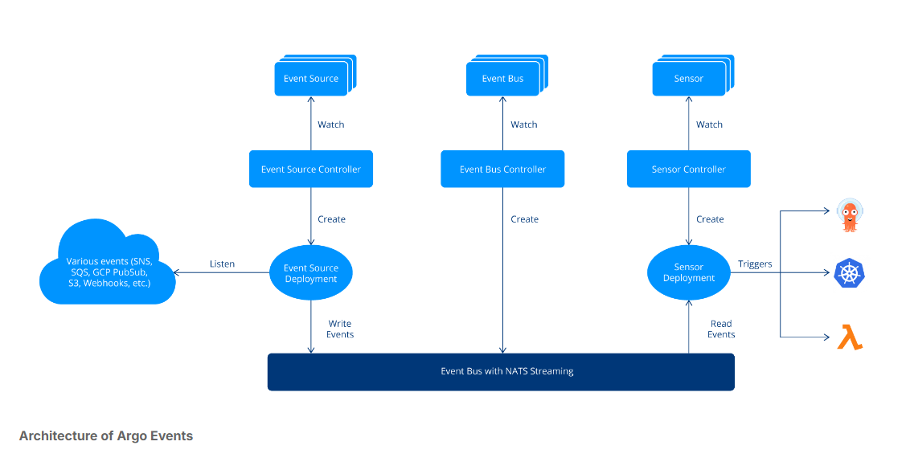

# Chapter Overview and Objectives
In this chapter, we discuss Argo Events, exploring its role in implementing event-driven architecture within Kubernetes. Starting with a conceptual overview, we'll understand the key components of Argo Events—Event Sources, Sensors, EventBus, and Triggers, and their significance in Kubernetes. The chapter then transitions to practical learning, with labs focused on configuring event sources and triggers, and integrating Argo Events with external systems like webhooks and message queues.

By the end of this chapter, you should be able to:

- Learn how event sources initiate the event-driven process in Kubernetes.
- Understand the detection and response mechanism of sensors and triggers in event-driven systems.
- Grasp the importance of the EventBus in managing event flow within Argo Events.

## Event-Driven Architecture
In this section, we explore the concept of event-driven architecture (EDA) and its practical application in Kubernetes environments. Unlike traditional architectures where components operate in a linear, request-response manner, EDA is based on a more dynamic and fluid model. This model is particularly relevant in Kubernetes, a system that manages containerized applications across clusters and thrives on responsiveness and adaptability.

At the core of Kubernetes are events - these are various actions or changes within the system, like pod lifecycle changes or service updates. EDA in Kubernetes involves responding to these events in a way that's both automated and scalable. This method of operation allows for a more efficient handling of the ever-changing state within a Kubernetes cluster.

Argo Events enters the picture as a tool designed for Kubernetes, aimed at facilitating the implementation of event-driven paradigms. It isn't just an add-on but rather an integration that amplifies Kubernetes' capabilities. The main components of Argo Events are:

- Event Source: This is where events are generated. Event sources in Argo Events can be anything from a simple webhook or a message from a message queue, to a scheduled event. Understanding event sources is key to knowing how your system will interact with various external and internal stimuli.
- Sensor: Sensors are the event listeners in Argo Events. They wait for specific events from the event sources and, upon detecting these events, trigger predefined actions. Understanding sensors involves knowing how to respond to different types of events.
- EventBus: The EventBus acts as a backbone for event distribution within Argo Events. It's responsible for managing the delivery of events from sources to sensors. Understanding the EventBus is crucial for managing the flow of events within your system.
- Trigger: Triggers in Argo Events are the mechanisms that respond to events detected by sensors. They can perform a wide range of actions, from starting a workflow to updating a resource. Understanding triggers is essential for automating responses to events.

The image depicts the architecture of Argo Events, showing three main components: Event Source, Event Bus, and Sensor, each with a controller and deployment. The Event Source receives various events (like SNS, SQS, GCP PubSub, S3, Webhooks, etc.), which are managed by the Event Source Controller and passed on to the Event Source Deployment. This connects to the Event Bus with NATS Streaming through the Event Bus Controller. Finally, the Sensor Controller manages the Sensor Deployment, which triggers workflows in Kubernetes and functions in AWS Lambda, illustrated by respective icons.
