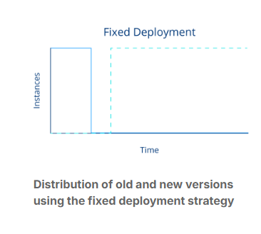
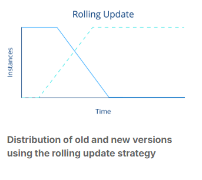
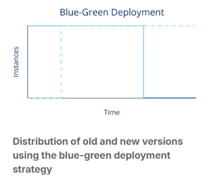
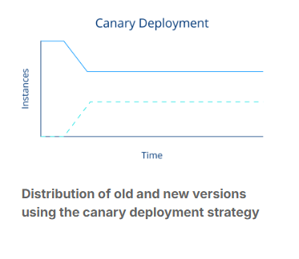
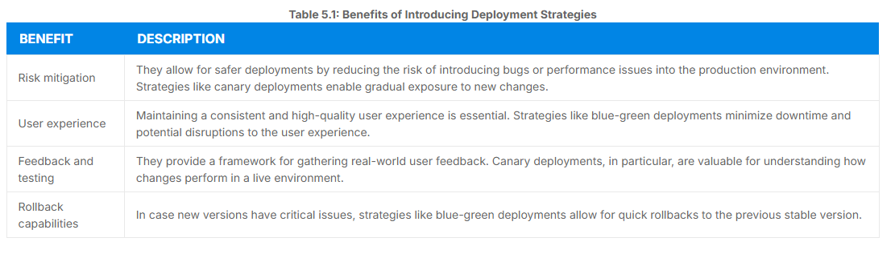
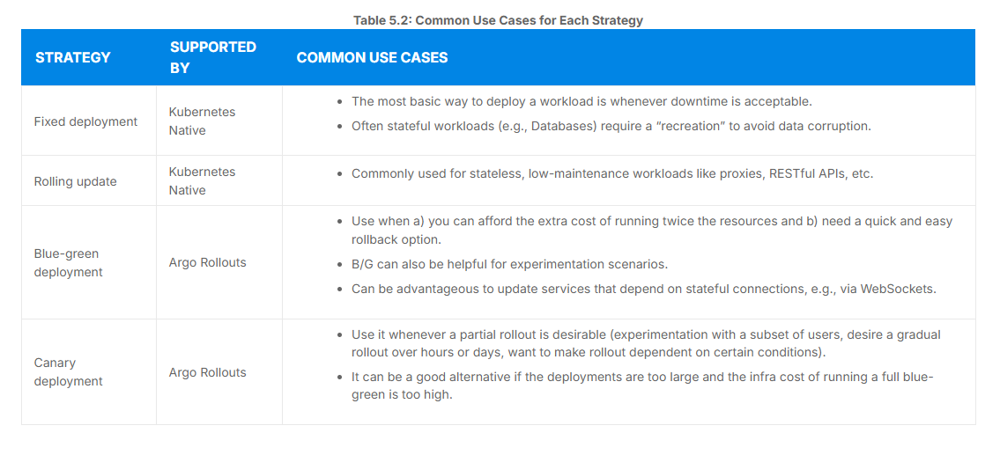
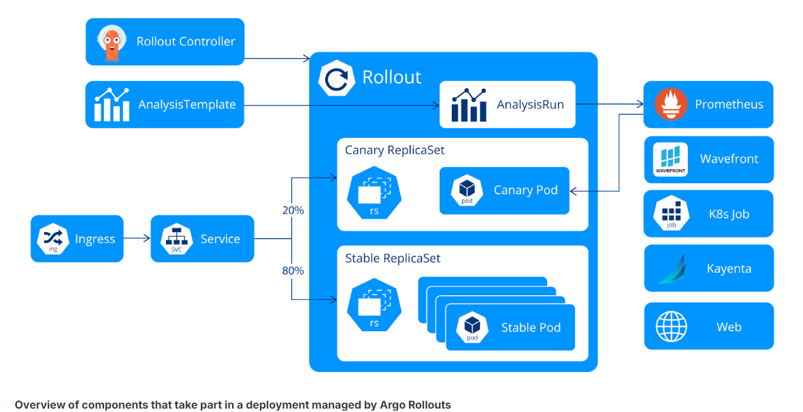
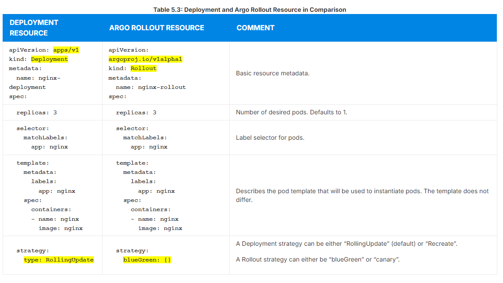
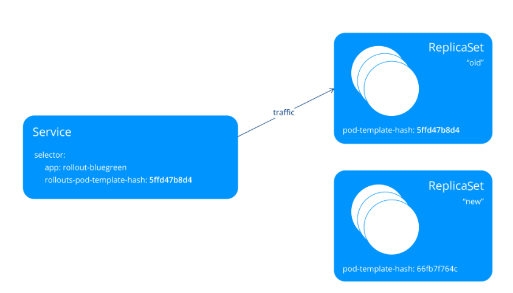
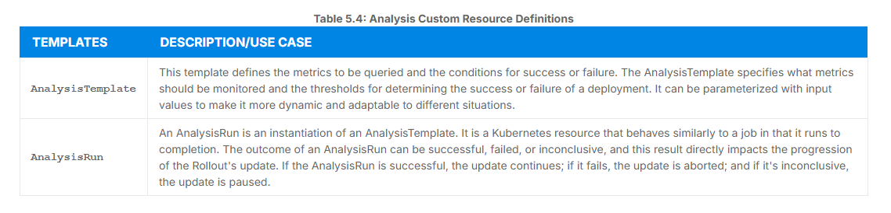

# Chapter Overview and Objectives
In this chapter, we delve into Argo Rollouts, a pivotal tool within the Argo suite, designed specifically for Continuous Delivery (CD) and GitOps practices. Argo Rollouts can be used as a stand-alone tool and therefore does not require any prior knowledge of ArgoCD (or other Argo-related tools). Through thematic discussions and hands-on labs, we aim to equip you with a comprehensive understanding of Argo Rollouts’ architecture, installation, and usage.

By the end of this chapter, you should be able to:

Understand and differentiate various Progressive Delivery patterns and decide when to use which.
Have a thorough understanding of what Argo Rollouts is and in what scenarios it might help.
Have an overview of Argo Rollouts architecture and functionality.

## Essentials of CI/CD and Progressive Delivery in Software Development
Continuous Integration (CI), Continuous Delivery (CD), and Progressive Delivery are key concepts in modern software development, particularly in the context of DevOps and agile practices. They represent different stages or approaches in the software release process. We will discuss them more in this chapter.

## Continuous Integration
Continuous Integration is a development practice where developers frequently integrate their code into a shared repository, preferably several times daily. Each integration is then verified by an automated build and automated tests.

## CI Features

### Frequent code commits
Encourage developers to often integrate their code into the main branch, reducing integration challenges.

### Automated tests
Cover frequent code commits. Automatically running tests on the new code to ensure it integrates well with the existing codebase. This does not only include unit tests, but also any other higher-order testing method, such as integration- or end-to-end tests.

### Immediate problem detection
Allows for quick detection and fixing of integration issues.

### Reduced integration problems
Help to minimize the problems associated with integrating new code.

The main goal of CI is to provide rapid feedback so that if a defect is introduced into the code base, it is identified and corrected as soon as possible.

Once code is in our main branch, it is not deployed in production or even released. This is where the concept of Continuous Delivery comes into play.

## Continuous Delivery
Continuous Delivery is an extension of CI, ensuring the software can be reliably released anytime. It involves the automation of the entire software release process.

## CD Features

### Automated release process
Every change that passes the automated tests can be released to production through an automated process.

### Reliable deployments
Ensure that the software is always in a deployable state.

### Rapid release cycles
Facilitate frequent and faster release cycles.

### Close collaboration between teams
A close alignment between development, QA, and operations teams is required.

The objective of Continuous Delivery is to establish a process where software deployments become predictable, routine, and can be executed on demand.

## Progressive Delivery
Progressive delivery is often described as an evolution of continuous delivery. It focuses on releasing updates of a product in a controlled and gradual manner, thereby reducing the risk of the release, typically coupling automation and metric analysis to drive the automated promotion or rollback of the update.

## Progressive Delivery Features

### Canary releases
Gradually roll out the change to a small subset of users before rolling it out to the entire user base.

### Feature flags
Control who gets to see what feature in the application, allowing for selective and targeted deployment.

### Experiments & A/B testing
Test different versions of a feature with different segments of the user base.

### Phased rollouts
Slowly roll out features to incrementally larger segments of the user base, monitoring and adjusting based on feedback.

The primary goal of Progressive Delivery is to reduce the risk associated with releasing new features and to enable faster iteration by getting early feedback from users.

## Deployment Strategies
Every software system is different, and deploying complex systems oftentimes requires additional steps and checks. This is why different deployment strategies emerged over time to manage the process of deploying new software versions in a production environment.

These strategies are an integral part of DevOps practices, especially in the context of CI/CD workflows. The choice of a deployment strategy can significantly impact the availability, reliability, and user experience of a software application or software service.

On the following pages, we will present the four most important deployment strategies and discuss their impact on user experience during deployment:

- Recreate/fixed deployment
- Rolling update
- Blue-green deployment
- Canary deployment

## Recreate/Fixed Deployment
A Recreate deployment deletes the old version of the application before bringing up the new version. As a result, this ensures that two versions of the application never run at the same time, but there is downtime during the deployment. This strategy is also supported by the Kubernetes Deployment object.



## Rolling Update
A Rolling Update slowly replaces the old version with the new version. As the new version comes up, the old version is scaled down in order to maintain the overall count of the application. This reduces downtime and risk as the new version is gradually deployed. This is the default strategy of the Kubernetes Deployment object.



## Blue-Green Deployment
A blue-green deployment (sometimes referred to as a red/black) has both the new and old versions of the application deployed at the same time. During this time, only the old version of the application will receive production traffic. This allows the developers to run tests against the new version before switching the live traffic to the new version. Once the new version is ready and tested, the traffic is switched (often at the load balancer level) from the old environment to the new one. The advantage here is a quick rollback in case of issues and minimal downtime during deployment.

An important drawback of a blue-green deployment is, that twice the amount of instances is created during the time of the deployment. This is a common show-stopper for this pattern.

To learn more about the blue-green deployment, see the article by Martin Fowler.



## Canary Deployment
A small subset of users are directed to the new version of the application while the majority still use the old version. Based on the feedback and performance of the new version, the deployment is gradually rolled out to more users. This reduces risk by affecting a small user base initially, allows for A/B testing and real-world feedback.

Some more detailed information can be found in the Canary Release article by Danilo Sato.



## Strategies for Smooth and Reliable Releases
In summary, deployment strategies are fundamental in modern software development and operations for ensuring smooth, safe, and efficient software releases. They cater to the need for balancing rapid deployment with the stability and reliability of production environments.






## Building Blocks of Argo Rollouts
In this section, we will discuss the building blocks of Argo Rollouts. To give you an overview of what to expect, we’ll briefly describe the relevant components of an Argo Rollouts setup before we discover them in more detail.



## Argo Rollouts Components

### Argo Rollouts Controller
An operator that manages Argo Rollout Resources. It reads all the details of a rollout (and other resources) and ensures the desired cluster state.

### Argo Rollout Resource
A custom Kubernetes resource managed by the Argo Rollouts Controller. It is largely compatible with the native Kubernetes Deployment resource, adding additional fields that manage the stages, thresholds, and techniques of sophisticated deployment strategies, including canary and blue-green deployments.

### Ingress
The Kubernetes Ingress resource is used to enable traffic management for various traffic providers such as service meshes (e.g., Istio or Linkerd) or Ingress Controllers (e.g., Nginx Ingress Controller).

### Service
Argo Rollouts utilizes the Kubernetes Service resource to redirect ingress traffic to the respective workload version by adding specific metadata to a Service.

### ReplicaSet
Standard Kubernetes ReplicaSet resource used by Argo Rollouts to keep track of different versions of an application deployment.

### AnalysisTemplate and AnalysisRun
Analysis is an optional feature of Argo Rollouts and enables the connection of Rollouts to a monitoring system. This allows automation of promotions and rollbacks. To perform an analysis an AnalysisTemplate defines a metric query and their expected result. If the query matches the expectation, a Rollout will progress or rollback automatically, if it doesn’t. An AnalysisRuns is an instantiation of an AnalysisTemplate (similar to Kubernetes Jobs).

### Metric Providers
Metric providers can be used to automate promotions or rollbacks of a rollout. Argo Rollouts provides native integration for popular metric providers such as Prometheus and other monitoring systems.

Please note, that not all of the mentioned components are mandatory to every Argo Rollouts setup. The usage of Analysis resources or metric providers is entirely optional and relevant for more advanced use cases.

## A Refresher: The Kubernetes Replica Set
To grasp the workings of Argo Rollouts in handling workloads, it's essential to understand some basics of Kubernetes. Essentially, Argo Rollouts functions in a manner quite similar to Kubernetes Deployment resources. What is less commonly known is that Deployments provide another layer of abstraction for workload management. The Deployment resource was a relatively later addition to Kubernetes, debuting in version 1.5 as part of the apps/v1beta1 API and achieving stability in version 1.9 with the apps/v1 API. Before the introduction of Deployments, workload management was accomplished using ReplicaSets. And under the hood, they are used until today!

A Kubernetes ReplicaSet is a resource used to ensure that a specified number of pod replicas are running at any given time. Essentially, it's a way to manage the lifecycle of pods. The main function of a ReplicaSet is to maintain a stable set of pod replicas running at any given time. It does so by scheduling pods as needed to reach the desired number.

If a pod fails, the ReplicaSet will replace it; if there are more pods than needed, it will terminate the extra pods. ReplicaSets are used to achieve redundancy and high availability within Kubernetes applications.

For more sophisticated orchestration like rolling updates, rollbacks or scaling a ReplicaSet is not enough. Kubernetes introduced a higher-level (and usually better known) concept called Deployment resource that manages both the deployment and updating of applications.

A deployment is managed by the Kubernetes deployment controller and is responsible for updating ReplicaSets by providing declarative updates for them.

Lets create a Deployment of nginx proxies to demonstrate the ownership between Deployment and ReplicaSet:

```
$ kubectl create deploy nginx-deployment --image=nginx --replicas=3

deployment.apps/nginx-deployment created
```

Now make sure it properly scaled up:

```
$ kubectl get deployment

NAME               READY   UP-TO-DATE   AVAILABLE   AGE
nginx-deployment   3/3     3            3           47s
``` 
``` 
$ kubectl get replicaset

NAME                          DESIRED   CURRENT   READY   AGE
nginx-deployment-66fb7f764c   3         3         3       47s
``` 

The ReplicaSet nginx-deployment-66fb7f764c is managed by nginx-deployment. You can tell this by inspecting the ReplicaSet:

``` 
kubectl get replicaset nginx-deployment-66fb7f764c -ojsonpath='{.metadata.ownerReferences}' | jq
[
  {
    "apiVersion": "apps/v1",
    "blockOwnerDeletion": true,
    "controller": true,
    "kind": "Deployment",
    "name": "nginx-deployment",
    "uid": "1dd44efd-aab5-4475-aff2-32670201e2ef"
  }
]
``` 

As we see, the ownerReferences of the ReplicaSet state, that this resource is “owned” by a Deployment resource with the uid “1dd44efd-aab5-4475-aff2-32670201e2ef”. And indeed, this uid matches with the other Deployment we just created:

``` 
$ kubectl get deployment nginx-deployment -ojsonpath='{.metadata.uid}'

1dd44efd-aab5-4475-aff2-32670201e2ef
``` 
Deployments are a great invention of vanilla Kubernetes and are a successful abstraction. Rarely do people manage their pods manually through ReplicaSets. Deployments are the standard.

But despite all the praise, Deployment resources are still limited in their capabilities. They still do not support all deployment strategies we described in the previous section, “A Primer on Progressive Delivery”.

Let's talk about Argo Rollouts!

## Argo Rollouts
Here, we will explore the Argo Rollouts resource, which is the central element in Argo Rollouts, enabling advanced deployment strategies. A Rollout, in essence, is a Kubernetes resource that closely mirrors the functionality of a Kubernetes Deployment object. However, it steps in as a more advanced substitute for Deployment objects, particularly in scenarios demanding intricate deployment of progressive delivery techniques.

## Key Features of Argo Rollouts
Argo Rollouts outshine regular Kubernetes Deployments with several enhanced features.

## Argo Rollouts Functionalities

### Blue-green deployments
This approach minimizes downtime and risk by switching traffic between two versions of the application.

### Canary deployments
Gradually roll out changes to a subset of users to ensure stability before full deployment.

### Advanced traffic routing
Integrates seamlessly with ingress controllers and service meshes, facilitating sophisticated traffic management.

### Integration with metric providers
Offers analytical insights for blue-green and canary deployments, enabling informed decisions.

### Automated decision making
Automatically promote or roll back deployments based on the success or failure of defined metrics.

The Rollout resource is a custom Kubernetes resource introduced and managed by the Argo Rollouts Controller. This Kubernetes controller monitors resources of type Rollout and ensures that the described state will be reflected in the cluster.

The Rollout resource maintains high compatibility with the conventional Kubernetes Deployment resource but is augmented with additional fields. These fields are instrumental in governing the phases, thresholds, and methodologies of advanced deployment approaches, such as canary and blue-green strategies.

It’s crucial to understand that the Argo Rollouts controller is attuned exclusively to changes in Rollout resources. It remains inactive for standard deployment resources. Consequently, to use the Argo Rollouts for existing Deployments, a migration from traditional Deployments to Rollouts is required.

Overall, Deployment and Rollout resources look pretty similar. Refer to the following table to understand the minimal differences between both.



Of course, there are way more configuration options to control the behavior of a Rollout. Please refer to the official Argo Rollouts specification for more options.

## Migrating Existing Deployments to Rollouts

The similarity of Deployments and Rollouts spec makes it easier to convert from one to the other resource type. Argo Rollouts supports a great way to migrate existing Deployment resources to Rollouts.

By providing a spec.workloadRef instead of spec.template a Rollout can refer to a Deployments template:

```yaml
apiVersion: argoproj.io/v1alpha1
kind: Rollout
metadata:
  name: nginx-rollout
spec:
  replicas: 3
  selector:
    matchLabels:
      app: nginx
  workloadRef:
    apiVersion: apps/v1
    kind: Deployment
    name: nginx-deployment
[...]
```

The Rollout will fetch the template information from the Deployment (in our example named nginx-deployment) and start the in the Rollout specified number of pods.

Please note, that lifecycles of Deployment and Rollouts are distinct and managed by their respective controllers. This means that the Kubernetes Deployment controller will not start to manage Pods created by the Rollout. Also, the Rollout will not start to manage pods that are controlled by the Deployment.

This enables a zero-downtime introduction of Argo Rollouts to your existing cluster. It furthermore makes experimentation with multiple deployment scenarios possible.

## Discussion: Create Rollouts or Reference Deployments from Rollouts?
As Rollout resources can exist and operate without vanilla Deployments, the following question might arise: Should I always reference Deployments or is it better to start over with an independent Rollout resource, without the dependency of a reference?

And the simple answer to it is… it depends.

Generally, workloadRef has been invented to enable a simple and seamless way of migrating from Deployments to Rollouts. We even consider it useful as Administrators who are unfamiliar with Argo Rollouts might be confused if they see an array of Pods running but neither a running Deployment nor StatefulSet. To lower the barrier, referencing existing Deployments from a Rollout can be a good option.

If you use Deployment referencing, the Argo controller will copy the generation number of the referenced Deployment and stores it in a status field called workloadObservedGeneration. Therefore the rollouts own rollout.argoproj.io/workload-generation annotation should always match the generation of the deployment. This helps to identify deviation due to manipulation of either of the resources.

However, referencing comes at the cost of another resource dependency. Yet another resource to check in case of failure!

So, if you are sure you want to work with Argo Rollouts, use the native Rollout Resource.

Hint: It is also possible to migrate a Rollout resource to a native Deployment. Please refer to the official documentation for further information.

Additional learning resources:

- To explore the detailed specification of a Rollout, visit Argo Rollouts Specification.
- For guidance on transitioning from a Deployment to a Rollout, consult Migrating a Deployment to Rollout.

## Ingress and Service Resources

## Relevant Resources for Traffic Routing

### Kubernetes Ingress
A Kubernetes Ingress is a Kubernetes native resource that manages external access to services in a cluster (typically via HTTP). An Ingress allows defining rules for inbound connections to reach cluster-internal Kubernetes Services. As such, they are an important abstraction to programmatically control the flow of incoming network traffic. They can even be used for SSL/TLS termination.

### Kubernetes Service
A Kubernetes Service is a resource that abstracts how to expose an application running on a set of Pods. Services can load-balance traffic and provide service discovery within the cluster. The primary role of a Service is to provide a consistent IP address and port number for accessing the running application, irrespective of the changes in the pods.

In the context of Argo Rollouts, these resources play a pivotal role when it comes to, for example, canary deployments. The general behavior of Service and Ingress resources is no different when used with Argo. Argo Rollouts uses Kubernetes Services to manage traffic flow to different versions of an application during a rollout process and they do so by augmenting the service with additional metadata.

### Pod Template Hash
Argo Rollouts utilizes the Pod Template Hash, which uniquely identifies Pods of a common ReplicaSset. So to switch incoming traffic from the “old” ReplicaSet to our new ReplicaSet, the Argo Rollouts controller mutates the Service spec.selector to match the new Pod Template Hash.



Kubernetes Services have selectors that find matching pods according to their label set; the pod-template-hash label is added to every ReplicaSet and used to make routing decisions

### Stable/Canary ReplicaSets
By introducing a “stable service” and “canary services” in the Rollouts Spec, Argo can not only switch the traffic to Stable/Canary ReplicaSets, but also decide about the distribution of which ReplicaSet should receive how much traffic.

## Rollout Analysis & Experiments
The ability to split traffic between stable and canary workloads is good. But how do we decide if the canary workload is performing well and is therefore considered "stable"? That's right, metrics! An operator would closely observe the monitoring system (e.g., Prometheus, VMWare Wavefront or others) for certain metrics that indicate the application is working well. If you're thinking that this "observing metrics and making a decision" could be automated, you're right!

Argo Rollouts allows the user to run “Analysis” during the progressive delivery process. It primarily focuses on evaluating and ensuring the success of deployment based on defined criteria. These criteria can include custom metrics of your specific metric monitoring provider (see the official documentation for a conclusive list of supported metric providers).

The analysis process in Argo Rollouts involves following custom resources that work hand in hand with the already discussed resources.



Analysis resources allow Argo Rollouts to make informed decisions during the deployment process, like promoting a new version, rolling back to a previous version, or pausing the rollout for further investigation based on real-time data and predefined success criteria.

AnalysisRuns support various providers like Prometheus or multiple other monitoring solutions to obtain measurements for analysis. Those measurements can then be used to automate promotion decisions.

Besides just looking at metrics, there are other ways to decide if your rollout is doing well. The most basic (but commonly used) one might be the Kubernetes “Job” provider: if a job is successful, the metric is considered “successful". If the job returns with anything else than return code zero, the metric is considered “failed”.

The Web provider helps with seamless integration to custom services to help make promotion decisions.

Remember, it's not mandatory to use analysis and metrics when you're rolling out updates in Argo Rollouts.

If you want, you can control the rollout yourself. This means you can stop or advance the rollout whenever you choose. You can do this through the API or the command line. Also, you don't have to rely on automatic metrics for using Argo Rollouts. It's totally fine to combine automatic steps, like those based on analysis, with your own manual steps.

## Experiments
Experiments are an extended feature of Argo Rollouts designed to test and evaluate changes in two or more versions of an application in a controlled, temporary environment. The Experiment custom resource can launch AnalysisRuns alongside ReplicaSets. This is useful to confirm that new ReplicaSets are running as expected.

You can use experiments in Argo Rollouts to test different versions of your app at the same time. This is like doing A/B/C testing. You can set up each experiment with its own version of the app to see which one works best. Each experiment uses a template to define its specific version of the app.

The great thing about these experiments is that you can run several of them simultaneously, and each one is separate from the others. This means they don't interfere with each other.

To learn more about Analysis or Experiments, please consult the official documentation.
