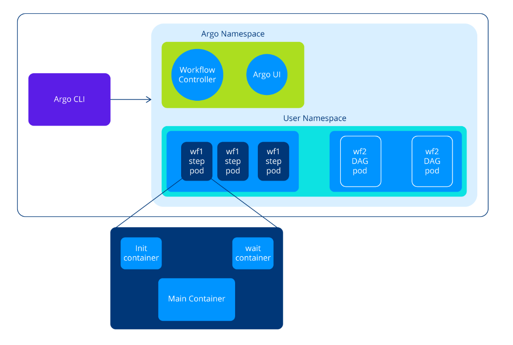

# Chapter Overview and Objectives
In this chapter, we will explore the details of Argo Workflows, an extension of Argo, a popular GitOps tool designed for declarative continuous delivery of Kubernetes applications. Argo Workflows allows you to define and manage complex workflows as code, providing a way to orchestrate and automate multi-step processes within the Kubernetes environment.

By the end of this chapter, you should be able to comprehend the basics and architecture of Argo Workflows. This involves understanding its key components, how they interact, and the fundamental concepts that govern the execution of workflows. Here are learning objectives for gaining proficiency in Argo Workflows:

Define and explain the structure of an Argo Workflow.
Recognize key elements such as metadata, spec, entrypoint, and templates.
Understand the role of templates in workflows.
Identify and explain the primary components of Argo Workflows, including the Workflow Controller, and UI.
Understand how Argo Workflows schedules and executes tasks.
Dive into the responsibilities of the Workflow Controller.

## Workflow
A workflow is a series of tasks, processes, or steps that are executed in a specific sequence to achieve a particular goal or outcome. Workflows are prevalent in various domains, including business, software development, and project management. In the context of Argo and other DevOps tools, a workflow specifically refers to a sequence of automated steps involved in the deployment, testing, and promotion of software applications.

In Argo, the term Workflow is a Kubernetes Custom Resource that represents a sequence of tasks or steps that are defined and orchestrated to achieve a specific goal. It is a higher-level abstraction that allows users to describe complex processes, dependencies, and conditions in a structured and declarative manner. A Workflow also maintains the state of a workflow.

Next, we will take a look at the specs of a simple Workflow.

The main part of a Workflow spec contains an entrypoint and list of templates, as shown in the example below:

```yaml
apiVersion: argoproj.io/v1alpha1
kind: Workflow
metadata:
  generateName: hello-world-
spec:
  entrypoint: whalesay
  templates:
- name: whalesay
  container:
    image: docker/whalesay
    command: [cowsay]
    args: ["hello world"]
```

A Workflow spec has two core parts:

- Entrypoint: Specifies the name of the template that serves as the entrypoint for the workflow. It defines the starting point of the workflow execution.
- Templates: A template represents a step or task in the workflow that should be executed. There are six types of templates that we will introduce next.

## Template Types
A template can be containers, scripts, DAGs, or other types depending on the workflow structure and is divided into two groups: template definitions and template invocators.

## Template Definitions

### Container
A Container is the most common template type and represents a step in the workflow that runs a container. It is suitable for executing containerized applications or scripts. Example:

```yaml
- name: whalesay
  container:
    image: docker/whalesay
    command: [cowsay]
    args: ["hello world"]
``` 

### Resource
A Resource represents a template for creating, modifying, or deleting Kubernetes resources. It is useful for performing operations on Kubernetes objects. Example:

```yaml
- name: k8s-owner-reference
  resource:
    action: create
    manifest: |
      apiVersion: v1
      kind: ConfigMap
      metadata:
        generateName: owned-eg-
      data:
        some: value
```

### Script
A Script is similar to the container template but allows specifying the script inline without referencing an external container image. It can be used for simple scripts or one-liners. Example:

```yaml
- name: gen-random-int
  script:
    image: python:alpine3.6
    command: [python]
    source: |
      import random
      i = random.randint(1, 100)
      print(i)
```

### Suspend
A Suspend is a template that suspends execution, either for a duration or until it is resumed manually. It can be resumed using the CLI, the API endpoint, or the UI. Example:

```yaml
- name: delay
  suspend:
    duration: "20s"
```

## Template Invocators

### DAG
A DAG allows defining our tasks as a graph of dependencies. It is beneficial for workflows with complex dependencies and conditional execution. Example:

```yaml
- name: diamond
  dag:
    tasks:
    - name: A
      template: echo
    - name: B
      dependencies: [A]
      template: echo
    - name: C
      dependencies: [A]
      template: echo
    - name: D
      dependencies: [B, C]
      template: echo
``` 

### Steps
Steps are defining multiple steps within a template as several steps need to be executed sequentially or in parallel.

```yaml
- name: hello-hello-hello
  steps:
  - - name: step1
      template: prepare-data
  - - name: step2a
      template: run-data-first-half
    - name: step2b
      template: run-data-second-half
``` 

## Outputs
In Argo Workflows, the outputs section within a step template allows you to define and capture outputs that can be accessed by subsequent steps or referenced in the workflow definition. Outputs are useful when you want to pass data, values, or artifacts from one step to another. Here's an overview of how outputs work in Argo Workflows. The Output comprises two key concepts:

- Defining Outputs: You define outputs within a step template using the outputs section. Each output has a name and a path within the container where the data or artifact is produced.
- Accessing Outputs: You can reference the outputs of a step using templating expressions in subsequent steps or the workflow definition.
Let’s consider a simple example where one step generates an output parameter and an output artifact, and another step consumes them:

```yaml
apiVersion: argoproj.io/v1alpha1
kind: Workflow
metadata:
  generateName: artifact-passing-
spec:
  entrypoint: artifact-example
  templates:
  - name: artifact-example
    steps:
    - - name: generate-artifact
        template: whalesay
    - - name: consume-artifact
        template: print-message
        arguments:
          artifacts:
          - name: message
            from: "{{steps.generate-artifact.outputs.artifacts.hello-art}}"

  - name: whalesay
    container:
      image: docker/whalesay:latest
      command: [sh, -c]
      args: ["cowsay hello world | tee /tmp/hello_world.txt"]
    outputs:
      artifacts:
    - name: hello-art
      path: /tmp/hello_world.txt

  - name: print-message
    inputs:
      artifacts:
      - name: message
        path: /tmp/message
    container:
      image: alpine:latest
      command: [sh, -c]
      args: ["cat /tmp/message"]
```

First the whalesay template creates a file name /tmp/hello-world.txt by using the cowsay command. Next, it outputs this file as an artifact called hello-art. The artifact-example template provides the generated hello-art artifact as an output of the generate-artifact step. Finally, the pint-message template takes an input artifact called message and consumes it by unpacking it in /tmp/message path and using the cat command to print it into standard output.

## WorkflowTemplate
In Argo Workflows, a WorkflowTemplate is a resource that defines a reusable and shareable workflow template, allowing users to encapsulate workflow logic, parameters, and metadata. This abstraction promotes modularity and reusability, enabling the creation of complex workflows from pre-defined templates.

Here is an example of a simple WorkflowTemplate definition in Argo Workflows:

```yaml
apiVersion: argoproj.io/v1alpha1
kind: WorkflowTemplate
metadata:
  name: sample-template
spec:
  templates:
   - name: hello-world
     inputs:
       parameters:
         - name: msg
           value: "Hello World!"
     container:
       image: docker/whalesay
       command: [cowsay]
       args: ["{{inputs.parameters.msg}}"]
```

In this example:

- The WorkflowTemplate is named sample-template
- It contains a template: hello-world
- The hello-world template takes a parameter message (with a default value of "Hello, World!") and generates a file with the specified message.

Once defined, this WorkflowTemplate can be referenced and instantiated within multiple workflows. For example:

```yaml
apiVersion: argoproj.io/v1alpha1
kind: Workflow
metadata:
  generateName: hello-world-
spec:
entrypoint: whalesay
templates:
  - name: whalesay
    steps:
      - - name: hello-world
          templateRef:
            name: sample-template
            template: hello-world
```

This workflow references the WorkflowTemplate named sample-template effectively inheriting the structure and logic defined in the template.

Using WorkflowTemplates is beneficial when you want to standardize and reuse specific workflow patterns, making it easier to manage, maintain, and share workflow definitions within your organization. They also help in enforcing consistency and reducing redundancy across multiple workflows.

## Defining Argo Workflows and Its Components
Argo Workflows is an open source workflow orchestration platform designed for Kubernetes. It enables users to define, run, and manage complex workflows using Kubernetes as the underlying execution environment.

## Building Blocks

### Argo Server
The Argo Server is a central component that manages the overall workflow resources, state, and interactions. It exposes a REST API for workflow submission, monitoring, and management. The server maintains the state of workflows and their execution and interacts with the Kubernetes API server to create and manage resources.

### Workflow Controller
The Argo Workflows Controller is a critical component within the Argo Workflows system. It is responsible for managing the lifecycle of workflows, interacting with the Kubernetes API server, and ensuring the execution of workflows according to their specifications. The Argo Workflows Controller continuously watches the Kubernetes API server for changes related to Argo Workflows Custom Resources (CRs). The primary CR involved is the Workflow, which defines the workflow structure and steps. Upon detecting the creation or modification of a Workflow CR, the controller initiates the corresponding workflow execution. The controller is responsible for managing the complete lifecycle of a workflow, including its creation, execution, monitoring, and completion. It also resolves dependencies between steps within a workflow. It ensures that steps are executed in the correct order, based on dependencies specified in the workflow definition.

### Argo UI
The Argo UI is a web-based user interface for visually monitoring and managing workflows. It allows users to view workflow status, logs, and artifacts, as well as submit new workflows.

Both the Workflow Controller and Argo Server run in the argocd namespace. We can opt for one of the cluster or namespaced installations, however, the generated Workflows and the Pods will be run in the respective namespace.

The diagram below shows an overview of a Workflow and also details of a namespace with generated pods.



A user defines a workflow using YAML or JSON files, specifying the sequence of steps, dependencies, inputs, outputs, parameters, and any other relevant configurations. Then the workflow definition file is submitted to the Kubernetes cluster where Argo Workflows is deployed. This submission can be done via the Argo CLI, Argo UI, or programmatically through Kubernetes API clients.

The Workflow Controller component of Argo Workflows continuously monitors the Kubernetes cluster for new workflow submissions or updates to existing workflows. When a new workflow is submitted, the Workflow Controller parses the workflow definition to validate its syntax and semantics. If there are any errors or inconsistencies, the Workflow Controller reports them to the user for correction.

Once the workflow definition is validated, the Workflow Controller creates the necessary Kubernetes resources to represent the workflow, such as Workflow CRDs (Custom Resource Definitions) and associated Pods, Services, ConfigMaps, and Secrets.

Finally, Workflow Controller begins executing the steps defined in the workflow. Each step may involve running containers, executing scripts, or performing other actions specified by the user. Argo Workflows ensures that steps are executed in the correct order based on dependencies defined in the workflow.

## Argo Workflow Overview
Each Step and DAG causes the generation of a Pod which comprises three containers:

- init: a template that contains an init container that performs initialization tasks. In this case, it echoes a message and sleeps for 30 seconds, but you can replace these commands with your actual initialization steps.
- main: a template contains the main container that executes the primary process once the initialization is complete.
- wait: a container that executes tasks such as clean up, saving off parameters, and artifacts.
To learn more about Experiments, please consult the official documentation.

## Examples
Argo Workflows is a versatile tool with a wide range of use cases in the context of Kubernetes and containerized environments. Here are some common use cases where Argo Workflows can be beneficial:

- To orchestrate end-to-end data processing pipelines, including data extraction, transformation, and loading (ETL) tasks.
- In machine learning projects, Argo Workflows can orchestrate tasks such as data preprocessing, model training, evaluation, and deployment.
- Argo Workflows can serve as the foundation for continuous integration and continuous deployment (CI/CD) pipelines. It enables the automation of building, testing, and deploying applications in a Kubernetes environment.
- For batch processing and periodic tasks, Argo Workflows can be configured to run at specified intervals or based on cron schedules. This is useful for automating routine tasks, report generation, and other scheduled jobs.

