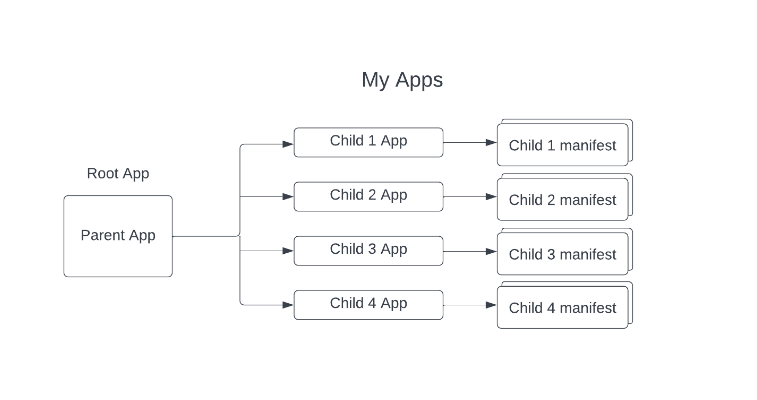
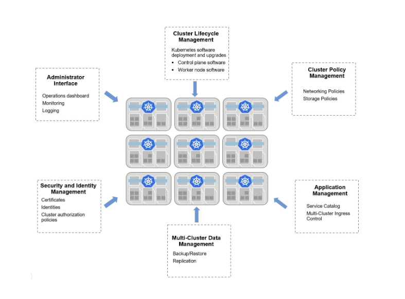
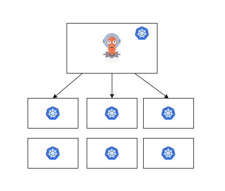
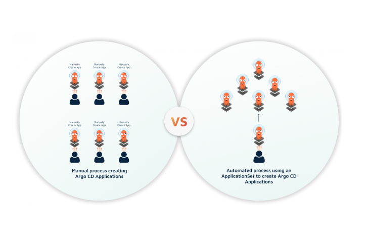

# Handling multiple Applications
This sections introduces how to manage multiple applications in ArgoCD also some best practices and patterns to considere.

## The App of Apps pattern
In GitOps Fundamentals, we covered how to deploy a single application but what about deploying multiple related applications at once? There are two main ways to handle multiple applications, App of Apps, and Application Sets. In this module we will answer the following questions:

- What problems does the App of Apps pattern solve?
- When is it best to use App of Apps?
- How do we use the App of Apps pattern?
- How does App of Apps enable GitOps?

Argo CD allows you to define an Application resource, which is responsible for enabling the deployment and synchronization of application resources to a Kubernetes cluster.

An application defines the git repo and folder where manifests are stored, which are all of your definitions that allow your app to run in Kubernetes. Argo CD supports raw YAML manifests, custom config management and the config management tools: Kustomize, Helm, and Jsonnet.

What if we need to deploy more than one application? How do we handle those manifests? We need to create an application definition for each application being deployed, but since these apps are a group of related applications, wouldn't it be nice if Argo CD knew that?

### Grouping similar applications
The Argo community came up with a solution to our questions above with the App of Apps pattern. Essentially, this pattern allows us to define a root Argo CD application that will itself define and sync multiple child applications.

Instead of pointing to an application manifest, like we were before - the Root App points to a folder in Git, where we store the application manifests that define each application we want to create and deploy. This way you are able to declare all your applications inside a single YAML manifest
Here’s an example of the pattern to give you a better understanding.



This diagram above shows how our "parent" or "root app" contains the instructions for how to deploy our child applications for My Apps. The App of Apps pattern supports Kubernetes manifests, Kustomize, and Helm. However, for simplicity's sake, we will demonstrate using plain YAML.

From a directory structure, your Git repository might look something like this:

```
My Apps

├── my-projects
│   ├── my-project.yml
├── my-apps
│   ├── child-app-1.yml
│   ├── child-app-2.yml
│   ├── child-app-3.yml
│   ├── child-app-4.yml
├── root-app
└───├── parent-app.ym
```

The root app definition would look something like this:

```yaml
apiVersion: argoproj.io/v1alpha1
kind: Application
metadata:
  name: root-app
  namespace: argocd
spec:
  destination:
    namespace: my-app
    server: 'https://kubernetes.default.svc'
  project: my-project
  source:
    path: my-apps
    repoURL: 'https://github.com/hseligson1/app-of-apps'
    targetRevision: HEAD
```

The my-apps directory contains the application for each child app. Within that manifest, your file might look something like this:

```yaml
apiVersion: argoproj.io/v1alpha1
kind: Application
metadata:
  name: child-app-1
  namespace: argocd
spec:
  destination:
    namespace: my-app
    server: 'https://kubernetes.default.svc'
  project: my-project
  source:
    path: guestbook
    repoURL: 'https://github.com/argoproj/argocd-example-apps.git'
    targetRevision: HEAD
  syncPolicy:
    syncOptions:
      - CreateNamespace=true
    automated:
      selfHeal: true
      prune: true
```

Within the definition above, the “path” field instructs Argo CD to look at the guestbook folder within the repo for the Kubernetes manifest. This folder contains the manifests that define our applications using any of the supported ways (Helm, Kustomize, plain YAMLs etc).

So, essentially you can use the App of Apps pattern to manage your Application resources by adding or removing Application resources via your manifests to your Git repository. This encourages a GitOps workflow and eliminates the need to operate your Argo CD applications via the Web UI or the CLI.

### Use Cases of App of Apps

The main advantage of using App of Apps is that you can now treat several applications as a single unit while still keeping them isolated during deployment. The most common scenarios are

- Cluster bootstrapping
- Handling Argo CD applications without using the CLI or the GUI

For cluster bootstrapping, imagine that you have a set of applications that you always want to install in a new Kubernetes cluster. Instead of installing those applications one-by-one you can easily group them in a single application and then install that instead.

For the second scenario you can edit an existing root app with just git operations (e.g. add folders in the paths it looks) and have Argo CD automatically deploy applications without going through the Argo CD CLI or the Web UI.

## Multi-cluster management

By default an Argo CD instance can deploy applications to the same cluster it is installed on. However, Argo CD has the capability to connect and deploy to external clusters.

This capability is very handy for organizations that have multiple clusters and don’t want to manage Argo CD instances for each new cluster they create.

Nowadays it’s common for organizations to run and manage multiple clusters across different providers and infrastructures. So, as these organizations mature and containerize their applications, many are seeking to utilize multi-cluster, multi-region, and multi-provider deployments. This allows organizations to reap the benefits of centralized clusters in reference to scalability, reliability, performance, etc.

But first, let’s better understand the importance and challenges of multi-cluster deployments that these organizations face.

### Understanding multi-cluster management
It might go without saying what defines “multi-cluster”. However, multi-cluster management and deployments do not always mean more than one cluster. It’s more so about the orchestration and managing those clusters as if they were a single platform.

This doesn’t mean clusters need container identical workloads, in fact, the opposite. Each of your clusters is an independent contractor that controls its own provisioning, services, resources, and security schema.



So, when it comes to the deployment of your system it could come down to two different approaches:

#### Centralized/Distributed

It’s certainly beneficial to have multiple clusters within a centralized hosting environment. For example, you can have individual clusters for your QA, Staging, and Production environments. You can also distribute these clusters across these multiple environments. You can even distribute these clusters more broadly across different providers and geographies. However, it’s entirely up to you when utilizing a distributed approach you ask yourself, “How distributed?” Yet, it’s true the more distributed - the better.

We'll discuss performance considerations more deeply in another module. Argo CD does have a high-availability version that allows for managing a larger number of resources. Performance, security, and team structure are all considerations for this option.

#### Multi-Region/Single-Region

A distributed multi-cluster deployment that’s limited to a region like the United States or a specific virtual private cloud will have different considerations than an application workload that needs to address the needs of users in Asia or the European Union. In fact, a global deployment has its OWN set of unique challenges and requirements.

These approaches create a sort of progression within Kubernetes containerization that represents the application maturity, from a single cluster to a centralized multi-cluster approach, to distributed multi-cluster, and then ultimately these multi-region deployments.

This shows us that Kubernetes enables organizations to orchestrate their systems to best handle distributed multi-region and multi-cluster choreography. You can also apply tools to help you manage this sort of deployment like Argo CD which supports these deployment approaches for all 3 cases

- Having an Argo CD instance for each deployment cluster
- Having a single Argo CD instance that deploys to all clusters
- Have multiple Argo CD instances that control multiple deployment clusters

### Internal and External clusters with Argo CD
So, how can we use Argo CD with both internal and external (public/private) clusters across a number of clouds and how does it manage those?

After initial installation Argo CD can automatically deploy to its own cluster. This cluster is referred to as “internal”.

You can add additional external clusters with the Argo CD CLI.
To add one of your public/local clusters with the argocd CLI, you first need to ensure you have a valid context in your kubeconfig for the cluster.
Next, run:

``` 
 argocd cluster add <context name>
```

This command will create a new service account on the target cluster and add that target cluster to Argo CD.

To remove a public/local cluster you first need to identify the server URL, which for an internal cluster is typically: https://kubernetes.default.svc, otherwise you just need to execute the following command with the argocd CLI:

```
argocd cluster list
``` 

This command will list all clusters with their name and server. Next, run the following command to remove the cluster:

```
argocd cluster rm <server>
``` 

Important note: when removing a cluster it does not remove the Argo CD Applications associated with it.

### Communication between the Argo CD instance and deployment clusters

When utilizing an external cluster you will have a single Argo CD installation to register all your target clusters, enabling a single path for all your GitOps deployments across your various clusters.

A challenge one might face using an external cluster is the communication between Argo CD and the Kubernetes API of your cluster. In order to register your private cluster with Argo CD you can do this by using an argocd CLI command listed above where the context name is available in your current kubectl config.

However, when you execute the argocd add context command it installs a ServiceAccount (aka your argocd-manager) into the kube-system namespace of your kubectl context and binds the service account to an admin-level ClusterRole. The configuration and connection information is added to the management cluster in the form of a secret. Clusters, like all things in Argo CD can be managed declaratively.

This will also register the cluster in Argo CD with the endpoint in your context and validate if Argo CD is able to communicate with your API service, allowing Argo to access the private ClusterIP.
Once your LoadBalancer is ready with a public IP address, you can update your DNS record and point your domain to the LoadBalancer.


Lastly, you simply need to verify that your service and pods are running correctly!

Important note: If you ever want to view details about your cluster you can do so within the Argo CD web UI.

You can go to Settings > Clusters in your Argo CD instance within the browser, then click on the row that identifies as your cluster. You can also click on the "Edit" button in the top right corner to edit the cluster name or allowed namespaces you’ve assigned.

In case you need to remove a cluster using the web UI, go to Settings > Clusters again in your Argo CD instance in the browser. Then, find your cluster and click on the three dots on the right hand side of the cluster row, then click "Delete".

Managing Argo CD applications across multiple Kubernetes clusters is challenging, especially if they are rigidly controlled by a private environment or running with multiple cloud providers.
However, Argo CD can manage multiple external targets which can form a single centralized place for you to deploy and monitor your apps across these clusters.

### Multi-cluster management approaches using Argo CD

Argo CD allows you to build a multi-tenant platform on top of one or many Kubernetes clusters. Below we’ll identify different approaches you can use to manage a single Argo CD instance for your cluster or manage multiple Argo CD instances on various clusters, in addition to grouping Argo CD instances on multiple clusters.

Let’s dive into it!

#### Managing a single Argo CD instance for your clusters

You can use one Argo CD instance to manage all your clusters within your organization and leverage features like a SSO integration, RBAC, and Argo Projects to ensure security measures.



This is helpful when things start to get more complicated and you have more than one cluster, which is much more common within the workforce and community. Typically an organization’s team will host applications in different clusters with various namespaces and this approach is helpful for that!

#### Using multiple Argo CD instances with multiple clusters

Argo CD allows you to run an Argo CD instance per cluster. This allows organizations to reduce errors when sharing clusters and gives developers autonomy when needing to manage their infrastructure without help from an outside team.

This sort of approach is secure, however it does require a lot of effort managing any sort of RBAC rules and doesn’t leverage the maximum benefits of Argo CD.

### Managing grouped Argo CD instances with multiple clusters
Argo CD Projects provide a way to group Argo CD applications when organizations have multiple teams using Argo. Projects allow you to restrict what is deployed, where apps can be deployed, and what sort of objects (CRDs, RBAC, etc.) can be deployed.

You can specify which application should deploy to which namespace of a cluster. Meaning, you can manage permitted destination clusters and namespaces with an argocd CLI command:

```
argocd proj add-destination <project> <cluster>,<namespace>

argocd proj remove-destination <project> <cluster>,<namespace>
```

An Argo CD admin can create a project and decide which cluster it defines. However, this can be an issue when a developer needs to add a cluster after an initial creation of a project, forcing a developer to contact the admin to update a project definition.
This is why it’s important to configure RBAC security to enable self-service behavior, which is supported by Argo CD.

#### Other multi-tenancy Argo features

You can certainly utilize a mix of several approaches to manage your multiple Argo CD instances with a single or multiple Kubernetes clusters. Argo CD incorporates patterns such as the App of Apps pattern and ApplicationSets as one of its features. These allow you to deploy numerous applications or monorepos with a number of clusters, enabling the self-service mentioned before.

## ApplicationSet Generators

### Generating applications with ApplicationSets
Learn how to create, update, manage, and delete multiple Argo CD Applications using an ApplicationSet controller.

Within this course we will identify what an ApplicationSet is and help you answer the following questions:
- What is an ApplicationSet?
- When is it best to use the ApplicationSet controller?
- How does an ApplicationSet work and what are the benefits it provides?
- Why do I need a Generator and what types are there?

### What is an ApplicationSet?
Using Argo CD for your Kubernetes ecosystem to deploy applications is an excellent GitOps approach for your Continuous Deployment (CD) process. However, it can present challenges when trying to manage multiple Kubernetes manifests for your deployments, services, secrets, configs, and other files within your Git repository.

So, unlike an Argo CD Application resource that deploys resources from a single Git repository to a single cluster or namespace, the ApplicationSet expands this use-case. An ApplicationSet uses templated automation to create, modify, and manage multiple Argo CD applications at once, while also targeting multiple clusters and namespaces.

The ApplicationSet controller is installed alongside Argo CD (within the same namespace) and creates multiple Argo CD Applications based on the ApplicationSet Custom Resource (CR). This ensures that your Argo CD Applications remain consistent with your declared resource. It essentially takes the ApplicationSet and outputs one more or more Argo CD application.



### What is the best scenario to use an ApplicationSet?
When a user or team has “too many” applications to manage and needs to do the following:

- Deploy to multiple Kubernetes clusters
- Deploy to different namespaces
- Deploy to different namespaces on a single Kubernetes cluster
- Deploy from different Git repositories or folders/branches

Each of these use-cases can be executed using an Argo CD ApplicationSet.

### How does an ApplicationSet work?
Below is an example of an ApplicationSet resource that is used to target an Argo CD Application to multiple Kubernetes clusters. Within this example, it’s deploying a guestbook application using a List Generator.

```yaml
apiVersion: argoproj.io/v1alpha1
kind: ApplicationSet
metadata:
  name: guestbook
spec:
  generators:
    - list:
        elements:
          - cluster: engineering-dev
            url: 'https://kubernetes.default.svc'
          - cluster: engineering-prod
            url: 'https://kubernetes.default.svc'
  template:
    metadata:
      name: '{{cluster}}-guestbook'
    spec:
      project: default
      source:
        repoURL: 'https://github.com/argoproj/applicationset.git'
        targetRevision: HEAD
        path: 'examples/list-generator/guestbook/{{cluster}}'
      destination:
        server: '{{url}}'
        namespace: guestbook
``` 

The ApplicationSet is essentially made up of “generators” that generate Applications. The Generators are responsible for providing a set of key-value pairs, that are then passed into a template with styled parameters.

The template fields within an ApplicationSet spec are used to generate an Argo CD Application resource. The Argo CD Application is created by combining the params from the generator with the fields from the template.

So, as a result, the Generators’ job is to generate these parameters and the template’s job is to consume them, and the template is then applied to a Kubernetes cluster as Argo CD Applications.

Within the example above the List generator is passing the and fields into the Application template as the parameters

```yaml
template:
  metadata:
    name: '{{cluster}}-guestbook'
  spec:
    project: default
    source:
      repoURL: 'https://github.com/argoproj/applicationset.git'
      targetRevision: HEAD
      path: 'examples/list-generator/guestbook/{{cluster}}'
    destination:
      server: '{{url}}'
      namespace: guestbook
```

These fields will be rendered as two corresponding Argo CD Applications - one for each defined cluster.

```yaml
spec:
  generators:
    - list:
        elements:
          - cluster: engineering-dev
            url: 'https://kubernetes.default.svc'
          - cluster: engineering-prod
            url: 'https://kubernetes.default.svc'
``` 

So, any changes made to the template above will automatically be applied to each Application you created. Therefore, any changes you make to your set of Argo CD Applications are simplified by only managing a single ApplicationSet resource.
Now, let’s dive into the different Generators that help us manage our ApplicationSet and how they work now that we understand the basics!

### Generators
A Generator informs your ApplicationSet on how to generate multiple Applications and how to deploy them. There are currently six primary Generators that can be applied to your template to support different use-cases for your ApplicationSet and 2 generators that can be used for combining the primary ones.

#### List Generator

This is the Generator used in the example above that generates parameters based on a fixed list. It passes key-value pairs that you specify within the elements section of your template. This Generator enables a manual approach to control the Application destination by modifying the cluster list.

#### Cluster Generator

For each of your clusters you’ve registered with Argo CD, the Cluster Generator will produce your params based on the list of values within the cluster secret. It will then provide the param values to the Application template for each of your clusters.

#### Git Generator

This Generator includes two sub-types:

##### Directory Generator

This Generator generates params using the directory structure of your specific Git repository.
Below is an example of the ApplicationSet file with a Git Directory Generator sub-set:

```yaml
apiVersion: argoproj.io/v1alpha1
kind: ApplicationSet
metadata:
  name: appset-demo
spec:
  generators:
    - git:
        repoURL: 'https://github.com/hseligson1/appset-demo.git'
        revision: HEAD
        directories:
          - path: examples/git-dir-generator/apps
  template:
    metadata:
      name: '{{path[0]}}'
    spec:
      project: default
      source:
        repoURL: 'https://github.com/hseligson1/appset-demo.git'
        targetRevision: HEAD
        path: '{{path}}'
      destination:
        server: 'https://kubernetes.default.svc'
        namespace: '{{path.basename}}'
```
The name of your application is generated based on the name of your directory and denoted as the param: within the config in the YAML file above.

To get a better idea of how the file above would work below is an example of the Git Generator directory structure:

```
appset-demo/examples/git-dir-generator/apps
├── app-set.yaml
├── app-1
│   ├── templates
│   ├── Chart.yaml
│   └── values.yaml
└── app-2
    ├── templates
  
  ├── Chart.yaml
      └── values.yaml
```

The structure above contains two directories, one for each workload deploying app-1 and app-2 using a Helm chart.

Whenever a new Helm chart, Kustomize YAML file, or an Argo CD Application or sub-folder is added to your Git repository the ApplicationSet controller can detect this and will automatically deploy the manifest within a new Application resource.

#### File Generator

This Generator called the File Generator generates params using the content within a JSON/YAML file in your Git repository and reads a configuration file.
Below is an example of a directory structure:

```
├── apps
│   └── app-1
│       ├── templates
│       ├── Chart.yaml
│       └── values.yaml
├── cluster-config
│   └── environments
│       ├── staging
│       │   └── config.json
│       └── prod
│           └── config.json
└── git-generator-files.yaml
```

Included within the directory structure are:

- app-1: an application
- cluster-config: this contains JSON/YAML files that describe environment-specific clusters: one for staging and prod. Each folder contains the configuration file that describes the cluster.
- git-generator-files.yaml: this is the application resource used to deploy our app-1 application to the clusters.

Important note: the config.json file is what contains the information on how to deploy the application. This is done by providing the necessary parameters to pass to the template in the ApplicationSet manifest.

Whenever a change is made to the config.json file within the cluster-config folder above, it will automatically be discovered by the git-generator.

config.json example:
``` 
{
   "aws_account":"123456",
   "asset_id":"11223344",
   "cluster":{
      "owner":"cluster-admin@codefresh.com",
      "name":"environments-staging",
      "address":"https://1.2.3.4"
   }
}
``` 

As mentioned, the config.json params are applied to the ApplicationSet template:

```yaml
apiVersion: argoproj.io/v1alpha1
kind: ApplicationSet
metadata:
  name: appset-demo
spec:
  generators:
    - git:
        repoURL: 'https://github.com/hseligson1/appset-demo.git'
        revision: HEAD
        files:
          - path: examples/git-file-generator/cluster-config/**/config.json
  template:
    metadata:
      name: '{{cluster.name}}-app-1'
    spec:
      project: default
      source:
        repoURL: 'https://github.com/hseligson1/appset-demo.git'
        targetRevision: HEAD
        path: examples/git-file-generator/apps/app-1
      destination:
        server: '{{cluster.address}}'
        namespace: argocd
``` 

The config.json file found in the cluster-config folder is parameterized based on the path listed in the template above. Utilizing the configuration file instructs the ApplicationSet controller on how to deploy the application based on what you add to the JSON file. Currently JSON is the only supported format, but this could eventually change.

### SCM provider generator
The SCM provider generator can discover and iterate over whole Git repositories that are found in your provider (e.g. GitHub). This can be used for completely automating the creation of an environment and/or application whenever somebody creates a new repository in the specified GitHub organization.

### Pull Request Generator
The Pull Request Generator can iterate on Pull Requests from your Git provider (e.g. GitHub) and then create environments for each pull request found. This is a great way to create temporary environments (a.k.a. preview environments) when a developer or operator creates a new pull request.

### Cluster Decision Resource Generator
The Cluster Decision Resource Generator is an advanced generator that can discover clusters based on specific Kubernetes resources of any type that satisfy a set of criteria.

### Matrix/Merge generator
The Matrix and Merge generators are used for combining the primary generators. For example if you already have a Cluster generator for all your clusters and Git generator for all your apps, you can combine them with a matrix generator to deploy all your apps to all your clusters.