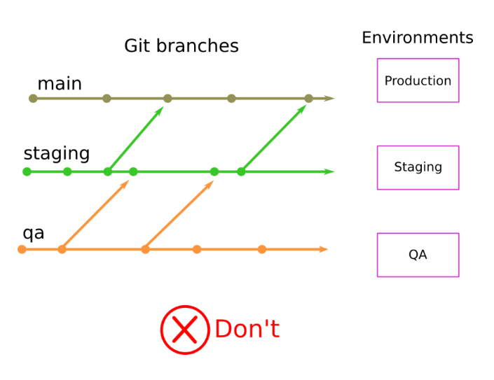
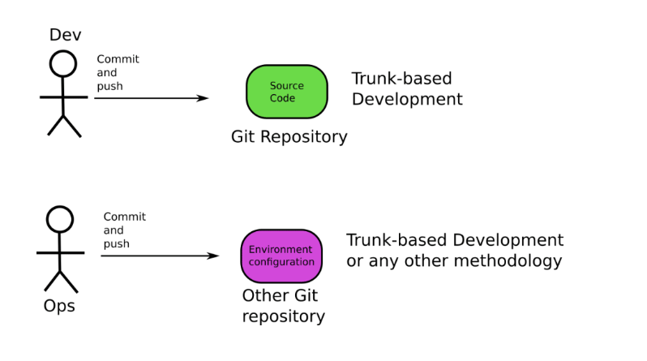
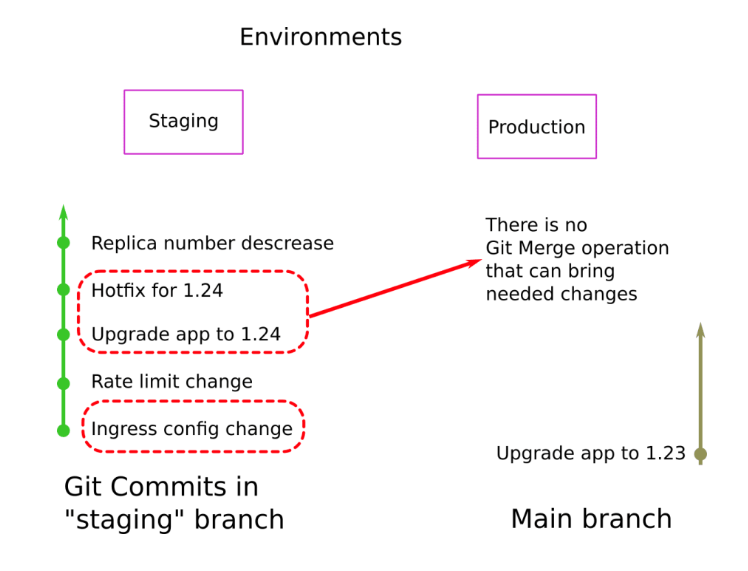
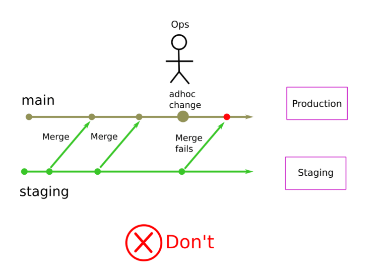
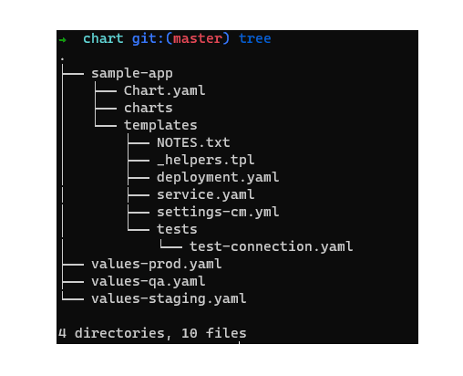

# Promoting releases with GitOps

## Git repository creation strategies
Deploying a single application to a single environment is a straightforward process as you have seen in the previous course. However, in a real situation, deployments span across multiple dimensions such as different Kubernetes clusters and/or different configurations.

One of the most popular questions asked by new GitOps adopters is how to deploy an application to the classic trilogy of environments (QA/Staging/Production) in a safe and repeatable way.

Even though the possibilities are endless when it comes to git repository organization, there are four distinct categories of suggested solutions:

- “Environment-per-branch”. In this case there is a Git branch for each environment. A “staging” branch holds the configuration for the staging environments, a “production” branch for production and so on. This approach is very popular and will be familiar to people that have adopted git flow in the past. We do NOT recommend you follow this approach.
- “Environment-per-folder”. In this case all environments are in a single Git repository and all are in the same branch. The filesystem has different folders that hold configuration files for each environment. The “staging” environment is described by a “staging” folder, the “production” environment is found in a “production” folder and so on. This is our recommended approach to start with.
- “Environment-per-repository”. In this case each environment is on its own git repository. So the “staging” environment is in a git repository called “staging”, the “production” environment is in a “production” git repository and so on.
- A combination of any of the previous approaches.

Each organization has different requirements and your choice will depend on a multitude of factors that also include non-technical aspects.

As a basic recommendation we suggest you adopt the “environment-per-folder” approach and specifically avoid the “environment-per-branch” approach.

## Avoid using the “environment-per-branch” approach
We recommend avoiding git branches for modeling different environments. If the git repository holding your configuration (manifests/templates in the case of Kubernetes) has branches named “staging”, “QA”, “Production” and so on, then you have fallen into a trap.



We will explore the following points on why this practice is an anti-pattern:

- Using different git branches for deployment environments is a relic of the past.
- Pull requests and merges between different branches is problematic.
- People are tempted to include environment specific code and create configuration drift.
- As soon as you have a large number of environments, maintenance of all environments gets quickly out of hand.
- The branch-per-environment model goes against the existing Kubernetes ecosystem.

### Using branches for different environments should only be applied to legacy applications.

When asked why someone chose to use git branches for modeling different environments, almost always the answer is a variation of “we’ve always done it that way,” “it feels natural,” “this is what our developers know,” and so on.

And that is true. Most people are familiar with using branches for different environments. This practice was heavily popularized by the venerable Git-Flow model. A lot has changed between now and when git-flow was introduced for environments. Even the original author has placed a huge warning at the top advising people against adopting this model without understanding the repercussions.

The fact is that the Git-flow model:

- Is focused on application source code and not environment configuration (let alone Kubernetes manifests).
- Is best used when you need to support multiple versions of your application in production. This happens, but is not usually the case.

We are not going to talk too much about Git-flow here and its disadvantages because the present article is about GitOps environments and not application source code, but in summary, we advise following trunk-based development and use feature-flags if you need to support different features for different environments.

In the context of GitOps, the application source code and your configuration should also be in different Git repositories (one repository with just application code and one repository with Kubernetes manifests/templates). This means that your choice of branching for the application source code should not affect how branches are used in the environment repository that defines your environments.



### Promotion is never a simple Git merge
Now that we know the history of using a branch-per-environment approach for deployments, we can talk about the actual disadvantages.

The main advantage of this approach is the argument that “Promotion is a simple git merge.” In theory, if you want to promote a release from QA to staging, you simply merge your QA branch into the staging branch. And when you are ready for production, you again merge the staging branch into the production branch, and you can be certain that all changes from staging have reached production.

To see what is different between production and staging, just do a standard git diff between the two branches. Do you want to backport a configuration change from staging to QA? Again, a simple git merge from the staging branch to QA will do the trick.

And if you want to place extra restrictions on promotions, you can use Pull Requests. So even though anybody could merge from QA to staging, if you want to merge something in the production branch, you can use a Pull Request and demand manual approval from all critical stakeholders.

This all sounds great in theory, and some trivial scenarios can actually work like this. But in practice, this is never the case. Promoting a release via a Git merge can suffer from merge conflicts, unwanted changes, and even the wrong order of changes.

As a simple example, let’s take this Kubernetes deployment that is currently sitting in the staging branch:

```yaml
apiVersion: apps/v1
kind: Deployment
metadata:
  name: example-deployment
spec:
  replicas: 15
  template:
    metadata:
      labels:
        app: my-app
    spec:
      containers:
        - name: backend
          image: 'my-app:2.2'
          ports:
            - containerPort: 80
```

Your QA team has informed you that version 2.3 (which is in the QA branch) looks good, and it is ready to be moved to staging. You merge the QA branch to the staging branch, promoting the application and think that everything is good.

What you didn’t know is that somebody also changed the number of replicas in the QA branch to 2 because of some resource limitations. With your Git merge, you not only deployed 2.3 to staging, but you also scaled the replicas to 2 (instead of 15), and that is probably something that you don’t want.

You might argue that it would be easy to look at the replica count before merging, but remember that in a real scenario you have a large number of applications with a big number of manifests that are almost always templated (via Helm or Kustomize). So understanding what changes you want to bring and what to leave behind is not a trivial task.

And even if you do find changes that should not be promoted, you need to manually choose the “good” parts using git cherry-pick or other non-standard methods which are a far cry from the original “simple” git merge.

But even if you are aware of all the changes that can be promoted, there are several cases where the order of promotion is not the same as the order of committing. As an example, the following 4 changes happen to the QA environment.

- The ingress of the application is updated with an extra hostname.
- Release 2.5 is promoted to the QA branch and all QA people start testing.
- A problem is found with 2.5 and a Kubernetes configmap is fixed.
- Resource limits are fine-tuned and committed to QA.

It is then decided that the ingress setting and the resource limits should move to the next environment (staging). But the QA team has not finished testing with the 2.5 release.

If you blindly merge the QA branch to the staging branch, you will get all 4 changes at once, including the promotion of 2.5.
To resolve this, again you need to use git cherry-pick or other manual methods.

There are even more complicated cases where the commits have dependencies between them, so even cherry-pick will not work.



### Configuration drift can be easily created by environment-specific changes
In theory, configuration drift should not be an issue with Git merges. If you make a change in staging and then merge that branch to production, then all your changes should transfer to the new environment.

In practice, however, things are different because most organizations only merge to one direction, and team members are easily tempted to change upstream environments and never back port changes to downstream environments.

In the classic example with 3 environments for QA, Staging, and Production, the direction of fit merges only goes to one direction. People merge the QA branch to staging and the staging branch to production. This means that changes only flow upwards.

#### QA -> Staging -> Production.

The classic scenario is that a quick configuration change is needed in production (a hotfix), and somebody applies the fix there. In the case of Kubernetes, this hotfix can be anything such as a change in an existing manifest or even a brand new manifest.

Now Production has a completely different configuration than staging. Next time a release is promoted from Staging to Production, git will only notify you on what you will bring from Staging.



This means that all subsequent deployments can fail, as Production now has an undocumented change that will never be detected by any subsequent promotions.

In theory, you could backport such changes and merge periodically all commits from production to staging (and staging to QA). In practice, this never happens due to the reasons outlined in the previous point.

You can imagine a large number of environments (and not just 3) further increasing the problem.

In summary, promoting releases by git merges does not solve configuration drift and in fact makes it even more problematic as teams are tempted to make ad hoc changes that are never promoted in sequence.

### Managing different git branches for a large number of environments is a losing battle

In all the previous examples, we only used 3 environments (QA-> Staging-> Production) to illustrate the disadvantages of branch-based environment promotion.

Depending on the size of your organization, you will have many more environments. If you factor in other dimensions such as geographical location, the number of environments can quickly skyrocket.

For example, let’s take a company that has 5 environments:

- Load Testing
- Integration testing
- QA
- Staging
- Production

Then let’s assume that the last 3 environments are also deployed to EU, US, and Asia while the first 2 also have GPU and Non-GPU variations. This means that the company has a total of 13 environments. And this is for a single application.

If you follow a branch-based approach for your environments:

- You need to have 13 long living Git branches at all times.
- You need 19 pull requests for promoting a single change across all environments.
- You have a two dimensional promotion matrix with 5 steps upwards and 2-3 steps outwards.
- The possibilities for wrong merges, configuration drift and ad-hoc changes is now non-trivial across all environment combinations.

In the context of this example organization, all previous issues are now more prevalent.

### The branch-per-environment model goes against Helm/Kustomize
Two of the most popular Kubernetes tools for describing applications are Helm and Kustomize. Let’s see how these two tools recommend modeling different environments.

For Helm, you need to create a generic chart that itself accepts parameters in the form of a values.yaml file. If you want to have different environments, you need multiple values files.



For Kustomize, you need to create a “base” configuration, and then each environment is modeled as an overlay that has its own folder:


In both cases, different environments are modeled with different folders/files. Helm and Kustomize know nothing about git branches or git merges or Pull Requests. They use just plain files.

So in summary, both Helm and Kustomize use plain files for different environments and not git branches. This should be a good hint on how to model different Kubernetes configurations using either of these tools.
If you introduce git branches in the mix, you not only introduce extra complexity, but you also go against your own tooling.

## Use folders for environments

The environment-per-folder approach is a much better way to organize your GitOps applications. Not only it is much simpler to implement and maintain, but it is also the optimal method for promoting releases between different GitOps environments.
